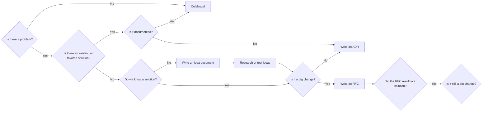

# # ADRs, Idea Docs, RFCs, Design Docs, Oh My!

```mermaid
graph LR
A{Is there a problem?} -- No --> B[Celebrate!]
A -- Yes --> C{Is there an existing or favored solution?}
C -- Yes --> D{Is it documented?}
D -- Yes --> B
C -- No --> E{Do we know a solution?}
E -- No --> F[Write an idea document]
F --> G[Research or test ideas]
G --> H{Is it a big change?}
E -- Yes --> H
H -- No --> I[Write an ADR]
D -- No --> I
H -- Yes --> J[Write an RFC]
J --> K{Did the RFC result in a solution?}
K -- Yes --> L{Is it still a big change?}
L 

```
<!--stackedit_data:
eyJoaXN0b3J5IjpbLTY4MDg4NDIyMSwtMTYxMjc5NjE2NV19
-->