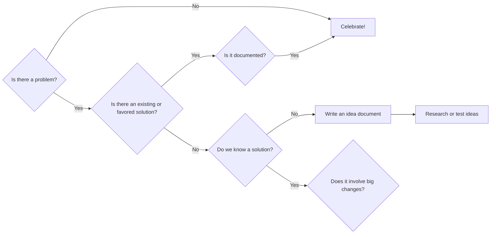

# # ADRs, Idea Docs, RFCs, Design Docs, Oh My!

```mermaid
graph LR
A{Is there a problem?} -- No --> B[Celebrate!]
A -- Yes --> C{Is there an existing or favored solution?}
C -- Yes --> D{Is it documented?}
D -- Yes --> B
C -- No --> E{Do we know a solution?}
E -- No --> F[Write an idea document]
F --> G[Research or test ideas]

E -- Yes --> H{Does it involve big changes?}

```
<!--stackedit_data:
eyJoaXN0b3J5IjpbLTQ5NTE4NjMzM119
-->