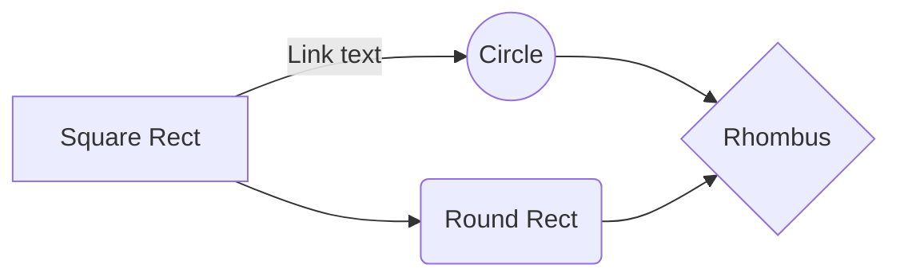

# hello, whirrled

## My "Way of Working"

_aka my post-ceremonial-agile processes_

- **All** work is shown on the board.
- Daily huddles are re-planning meetings, not status meetings.
- Prioritization, not estimation.
- Time-boxed effort, not deadlines.
- Record *all* decisions (using [ADRs](adrs.md), etc.)
- Iterative product evolution: 🛹 → 🛴 → 🚲 → 🏍 → 🚗

## Deep Thoughts

- [Architectural Decision Records](adrs.md)
- [Idea Documents](idea-documents.md)
- [Co-ops](co-ops.md)

<!--stackedit_data:
eyJoaXN0b3J5IjpbLTExNTU0NTQ5LC0xMjY3MzA3ODU1XX0=
-->