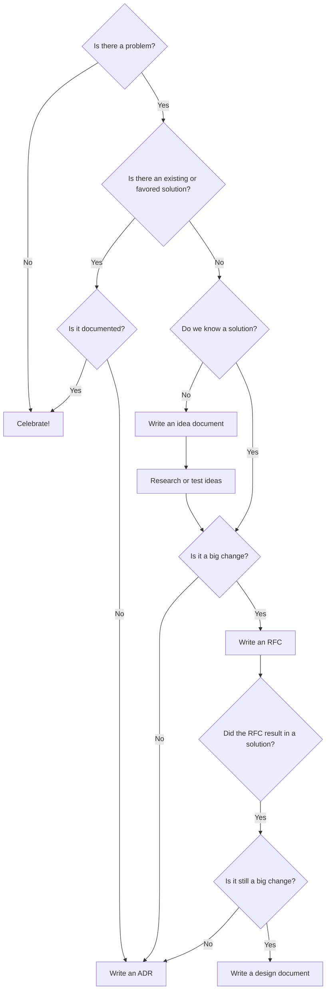

# ADRs, Idea Docs, RFCs, Design Docs, Oh My!

```mermaid
graph TD
PROBLEM{Is there a problem?} -- No --> CELEB[Celebrate!]
PROBLEM -- Yes --> SOLVED{Is there an existing or favored solution?}
SOLVED -- Yes --> DOC{Is it documented?}
DOC -- Yes --> CELEB
SOLVED -- No --> KNOWN{Do we know a solution?}
KNOWN -- No --> IDEA[Write an idea document]
IDEA --> TEST[Research or test ideas]
TEST --> BIG{Is it a big change?}
KNOWN -- Yes --> BIG
BIG -- No --> ADR[Write an ADR]
DOC -- No --> ADR
BIG -- Yes --> RFC[Write an RFC]
RFC --> RFCSOLVE{Did the RFC result in a solution?}
RFCSOLVE -- Yes --> BIGTOO{Is it still a big change?}
BIGTOO -- No --> ADR
BIGTOO -- Yes --> DD[Write a design document]
```
<!--stackedit_data:
eyJoaXN0b3J5IjpbMTE4OTcyMDIzMiwzODc5ODc4MDEsMTgxNj
cyMjY3OCwtMTYxMjc5NjE2NV19
-->