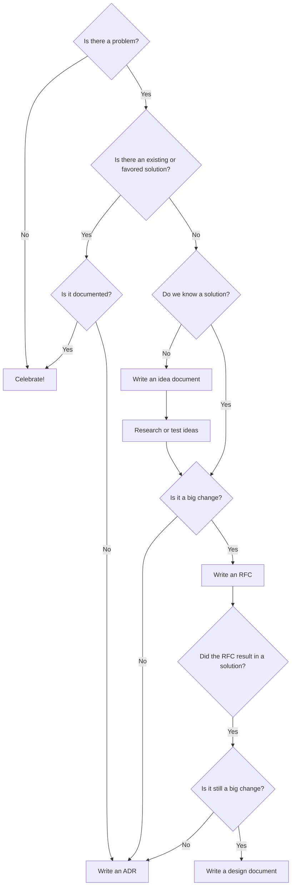

# ADRs, Idea Docs, RFCs, Design Docs, Oh My!

```mermaid
graph TD
A{Is there a problem?} -- No --> CELEB[Celebrate!]
A -- Yes --> C{Is there an existing or favored solution?}
C -- Yes --> DOC{Is it documented?}
DOC -- Yes --> CELEB
C -- No --> E{Do we know a solution?}
E -- No --> F[Write an idea document]
F --> G[Research or test ideas]
G --> H{Is it a big change?}
E -- Yes --> H
H -- No --> ADR[Write an ADR]
DOC -- No --> ADR
H -- Yes --> J[Write an RFC]
J --> K{Did the RFC result in a solution?}
K -- Yes --> L{Is it still a big change?}
L -- No --> ADR
L -- Yes --> DD[Write a design document]
```
<!--stackedit_data:
eyJoaXN0b3J5IjpbLTE3MTUyNzIwNjQsMzg3OTg3ODAxLDE4MT
Y3MjI2NzgsLTE2MTI3OTYxNjVdfQ==
-->